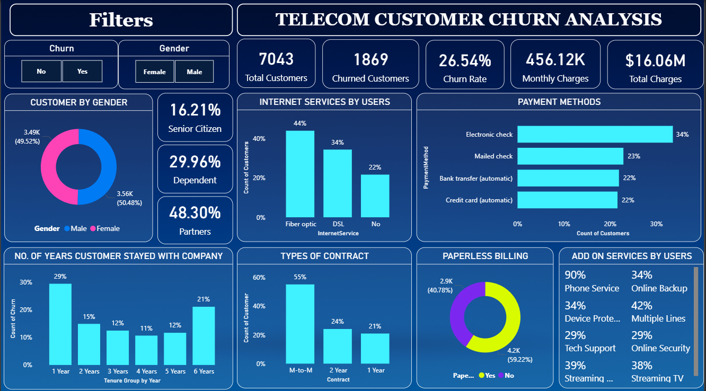

# 📊 Telecom Customer Churn Analysis

_Understanding customer churn behavior and identifying key factors that influence retention using Power BI._

---

## 📌 Table of Contents
- <a href="#overview">Overview</a>
- <a href="#business-objective">Business Objective</a>
- <a href="#dataset">Dataset</a>
- <a href="#tools--technologies">Tools & Technologies</a>
- <a href="#project-structure">Project Structure</a>
- <a href="#data-preparation">Data Preparation</a>
- <a href="#dashboard--visuals">Dashboard & Visuals</a>
- <a href="#key-findings">Key Findings</a>
- <a href="#recommendations">Recommendations</a>
- <a href="#business-impact">Business Impact</a>
- <a href="#how-to-view-dashboard">How to View Dashboard</a>
- <a href="#author--contact">Author & Contact</a>

---

<h2><a class="anchor" id="overview"></a>Overview</h2>

The **Telecom Customer Churn Analysis** project aims to help telecom companies understand customer behavior and identify the primary factors contributing to churn.  
Using **Power BI**, the analysis visualizes key metrics such as churn rate, customer tenure, payment methods, and service usage patterns — providing clear, data-driven insights to improve customer retention.

---

<h2><a class="anchor" id="business-objective"></a>Business Objective</h2>

The main goal of this project is to:
- Identify **why customers leave** the telecom company.  
- Find **key churn drivers** such as contract type, billing method, and services used.  
- Help the business take **data-driven actions** to reduce churn and improve satisfaction.

---

<h2><a class="anchor" id="dataset"></a>Dataset</h2>

- **Dataset Name:** Telecom Customer Churn Dataset  
- **Records:** 7,042  
- **Columns:** 21  
- **Source:** Kaggle  
- **Attributes:** Customer demographics, contract type, payment methods, internet service, tenure, and churn status.

---

<h2><a class="anchor" id="tools--technologies"></a>Tools & Technologies</h2>

- **Microsoft Power BI** – Dashboard creation and visualization   
- **GitHub** – Version control and project documentation  
---

<h2><a class="anchor" id="project-structure"></a>Project Structure</h2>

```
telecom-customer-churn-analysis/
│
├── README.md
├── Telecom_Customer_Churn_Analysis_Report.pdf
|
├── Telecom_Customer_Churn_Analysis_Presentation.pptx
│
├── dashboard/
│   └── Telecom_Churn_Dashboard.pbix
│
└── images/
    └── dashboard.png
```
<h2><a class="anchor" id="data-preparation"></a>Data Preparation</h2>

Performed detailed cleaning and transformation before visualization:

- Removed duplicate entries.  
- Handled missing values (especially in `TotalCharges`).  
- Converted binary fields (e.g., `SeniorCitizen` → Yes/No).  
- Created calculated columns for:
  - **Tenure (in months)**  
  - **Number of Services used**  
  - **Customer ratios (Partners, Dependents, Senior Citizens)**  

---

<h2><a class="anchor" id="dashboard--visuals"></a>Dashboard & Visuals</h2>

The **Power BI Dashboard** provides a complete picture of customer churn behavior through interactive visuals:

- **KPI Cards:** Total Customers, Churned Customers, Churn Rate, Monthly Charges, Total Charges  
- **Donut Charts:** Gender and Paperless Billing distribution  
- **Bar Charts:** Internet Service, Contract Type, and Payment Methods  
- **Tenure Analysis:** Number of years customers stayed with the company  
- **Service Usage:** Add-on services such as Online Backup, Tech Support, and Streaming TV  



---

<h2><a class="anchor" id="key-findings"></a>Key Findings</h2>

1. Customers with **month-to-month contracts** show the highest churn rate.  
2. Customers paying via **electronic checks** are more likely to churn.  
3. **Fiber optic users** churn more frequently than DSL users.  
4. **Paperless billing** adoption is high, indicating a shift toward digital services.  
5. **Short-tenure customers** (1–2 years) have a significantly higher churn probability.

---

<h2><a class="anchor" id="recommendations"></a>Recommendations</h2>

- Offer **discounts or rewards** for long-term contracts.  
- Promote **auto-pay incentives** to reduce churn from manual payments.  
- Improve **fiber optic service quality** and support experience.  
- Focus marketing efforts on **digital and paperless billing users**.

---

<h2><a class="anchor" id="business-impact"></a>Business Impact</h2>

This project helps decision-makers to:
- Identify **at-risk customers** early.  
- Design **targeted retention strategies**.  
- Improve **customer satisfaction** and **lifetime value**.  
- Increase overall **business profitability** through data-driven insights.

---

<h2><a class="anchor" id="how-to-view-dashboard"></a>How to View Dashboard</h2>

1. **Clone the repository:**
```bash
   git clone https://github.com/saurabhks001/telecom-customer-churn-analysis-powerbi.git
```
2. **Open the Power BI file:**
```bash
   dashboard/Telecom_Churn_Dashboard.pbix
```
2. **Explore interactive filters:**
 Use filters for Churn, Gender, Contract Type, and Internet Service to analyze customer behavior.
--- 

<h2><a class="anchor" id="author--contact"></a>Author & Contact</h2>
 
**Saurabh Shirole**  
📧 Email: saurabhshirole1@gmail.com 

🔗 [LinkedIn](https://www.linkedin.com/in/saurabh-shirole-19136a361/) | [GitHub](https://github.com/saurabhks001)  


